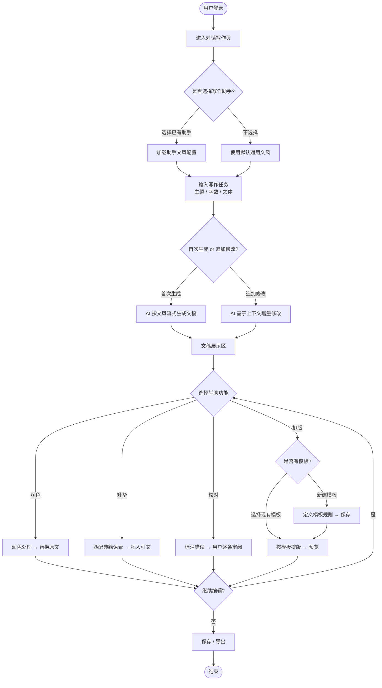
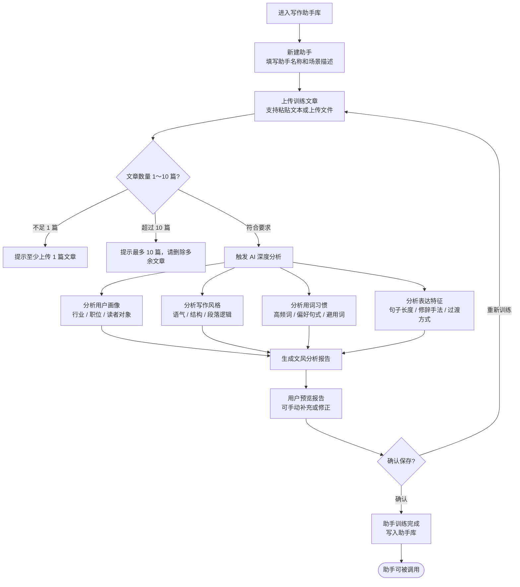
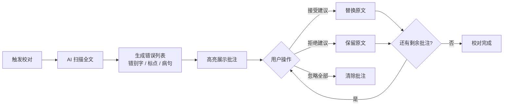
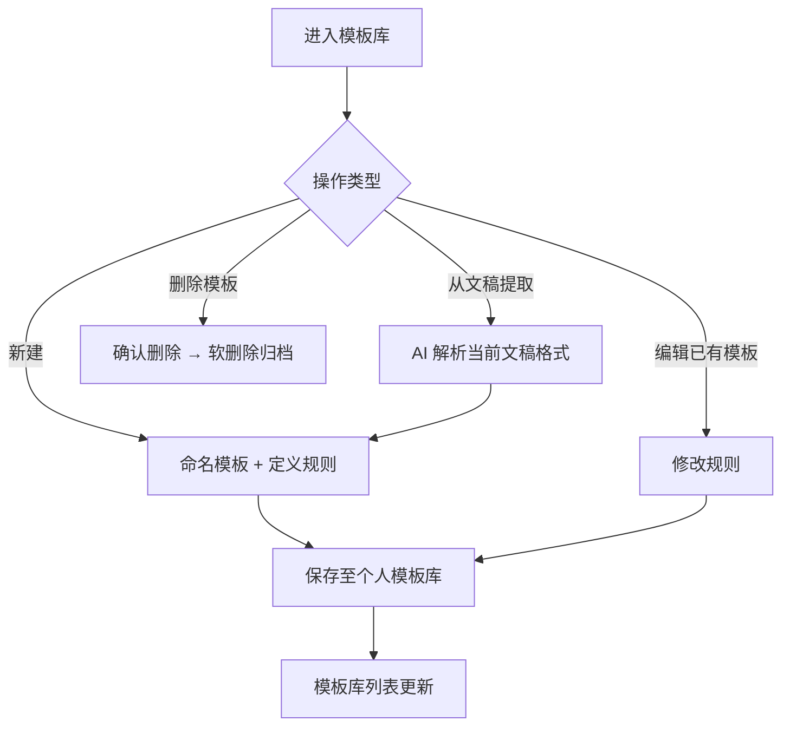

# PRD：AI 职场智能写作平台

> 版本：v0.2 | 状态：草稿 | 最后更新：2026-05-29
> 变更说明：明确产品定位为职场 B 端场景；新增「写作助手库」核心模块；更新角色定义、功能清单、流程图、数据字段及异常场景。

---

## 1. 一句话价值主张

为职场专业人士打造的 AI 写作助手——通过可训练的个人文风库、对话式文稿生成、润色、升华、校对与自动排版，帮助每一位职场人高效产出兼具个人风格与专业深度的文章。

---

## 2. 用户故事

### 角色定义

> 产品定位：面向**办公场景下的职场专业人士**，非泛 C 端用户。

| 角色 | 描述 |
|------|------|
| **职场写作者** | 需要撰写工作汇报、方案、总结、邮件的一线员工与管理者，追求专业表达与效率 |
| **团队负责人 / 管理者** | 需要维护团队统一写作风格、对下属稿件进行审核与优化的中高层 |
| **企业内容运营** | 负责产出公司官方文章、对外公告、品牌内容的内容专员，需保持品牌一致性 |
| **培训 / HR 从业者** | 需要撰写课程材料、内部培训文档、员工手册等正式文书的职能人员 |

### 用户故事列表

1. 作为**职场写作者**，我希望在对话框中输入汇报主题和关键信息，AI 能自动生成符合职场规范的文稿，以便节省从思路整理到成文的大量时间。

2. 作为**职场写作者**，我希望上传自己过去写过的 3～5 篇汇报文章，训练出一个专属的"我的写作助手"，以便日后 AI 生成的文章能保持我个人一贯的文风和用词习惯。

3. 作为**团队负责人**，我希望创建团队共用的写作助手，并将其分享给团队成员使用，以便统一团队对外文章的表达风格与格式规范。

4. 作为**企业内容运营**，我希望通过"润色"功能将初稿中的口语词和不规范表达一键替换为正式书面语，以便提升对外发布内容的专业性与可信度。

5. 作为**培训 / HR 从业者**，我希望通过"升华"功能将课程文档中的观点与儒家经典哲学相关联，以便丰富文章的思想维度，使培训材料更具感召力。

6. 作为**企业内容运营**，我希望保存自定义排版模板并在每次输出时一键调用，以便保证所有对外发布内容的版式统一、符合品牌规范。

7. 作为**职场写作者**，我希望使用"校对"功能自动检测文稿中的错别字、病句和标点问题，以便降低因文字疏漏带来的职业失误风险。

---

## 3. 功能清单

### P0 — 核心功能（MVP 必须上线）

| # | 功能模块 | 功能名称 | 简要说明 |
|---|----------|----------|----------|
| 1 | 对话写作 | AI 对话生成 | 用户在聊天框输入写作任务（主题、字数、文体等），AI 实时流式返回完整文稿 |
| 2 | 对话写作 | 多轮修改 | 用户可在同一对话内追加指令对生成内容做增量修改 |
| 3 | 辅助功能 | 润色 | 对全文或选中段落进行书面化改写，去除口语词、提升表达准确性 |
| 4 | 辅助功能 | 校对 | 检测错别字、标点错误、病句，以高亮批注呈现，用户可逐条接受/拒绝 |
| 5 | 写作助手库 | 助手创建与管理 | 用户可新建、命名、查看、删除写作助手；每个助手关联 1～10 篇训练文章 |
| 6 | 写作助手库 | 文章上传与训练 | 支持粘贴或上传文章（.txt / .docx），触发 AI 对文章特征的深度分析与建模 |
| 7 | 写作助手库 | 文风分析报告 | 训练完成后展示该助手的详细文风报告（见数据字段 6.4），供用户确认与编辑 |
| 8 | 写作助手库 | 文风调用 | 用户在发起写作任务时选择已有写作助手，AI 按该助手的文风特征生成文稿 |
| 9 | 基础设施 | 用户账号 | 注册、登录、基本个人信息管理（企业邮箱优先） |
| 10 | 基础设施 | 历史记录 | 对话/文稿自动保存，支持列表查看与全文检索 |

### P1 — 重要功能（第二阶段上线）

| # | 功能模块 | 功能名称 | 简要说明 |
|---|----------|----------|----------|
| 11 | 辅助功能 | 升华 | 分析文章核心观点，匹配《论语》《孟子》《道德经》等经典语录，嵌入引文与出处注释 |
| 12 | 辅助功能 | 排版 | 按用户指定模板对文稿进行结构化排版（标题层级、字体样式、段落间距等） |
| 13 | 模板库 | 排版模板管理 | 用户可新建、命名、保存、编辑、删除排版模板；支持从已排版文稿一键提取为模板 |
| 14 | 模板库 | 系统内置模板 | 提供通用公文、工作汇报、会议纪要、项目方案等职场场景预置模板 |
| 15 | 辅助功能 | 组合操作 | 支持对同一文稿依次或同时执行多个辅助功能（如先润色再升华） |
| 16 | 写作助手库 | 助手迭代训练 | 支持向已有助手追加训练文章，AI 自动合并更新文风模型 |

### P2 — 增强功能（后续迭代）

| # | 功能模块 | 功能名称 | 简要说明 |
|---|----------|----------|----------|
| 17 | 协作 | 团队助手共享 | 管理者可将写作助手共享给团队成员，统一团队写作风格 |
| 18 | 导出 | 多格式导出 | 支持将最终文稿导出为 .docx / .pdf / Markdown 格式 |
| 19 | 升华 | 典籍知识库扩展 | 支持接入更多经典（二十四史、唐诗宋词等），允许用户上传私有参考文献 |
| 20 | 分析 | 写作质量报告 | 生成可读性评分、词汇多样性、逻辑结构等分析指标 |
| 21 | 个性化 | 文风对比视图 | 展示"原始生成"与"助手文风生成"的差异对比，辅助用户理解文风效果 |
| 22 | 协作 | 文稿审阅流程 | 支持稿件的多人评论、审阅状态流转（草稿→审阅中→已通过） |

---

## 4. 核心流程图（Mermaid）

### 4.1 主流程：AI 对话写作（含文风调用）

### 4.2 子流程：写作助手训练

### 4.3 子流程：校对功能

### 4.4 子流程：排版模板管理

---

## 5. 关键数据字段定义

### 5.1 用户（User）

| 字段名 | 类型 | 说明 | 约束 |
|--------|------|------|------|
| user_id | string (UUID) | 用户唯一标识 | PK, 非空 |
| email | string | 登录邮箱（推荐企业邮箱） | 唯一, 非空 |
| nickname | string | 显示昵称 | 最长 32 字符 |
| company | string | 所属企业 | 可空 |
| job_title | string | 职位 | 可空 |
| created_at | datetime | 注册时间 | 非空 |

### 5.2 对话会话（Conversation）

| 字段名 | 类型 | 说明 | 约束 |
|--------|------|------|------|
| conversation_id | string (UUID) | 会话唯一标识 | PK, 非空 |
| user_id | string (UUID) | 所属用户 | FK → User |
| assistant_id | string (UUID) | 本次写作调用的写作助手；未选择则为 null | FK → WritingAssistant, 可空 |
| title | string | 会话标题（自动摘取或手动命名） | 最长 100 字符 |
| created_at | datetime | 创建时间 | 非空 |
| updated_at | datetime | 最后修改时间 | 非空 |

### 5.3 消息（Message）

| 字段名 | 类型 | 说明 | 约束 |
|--------|------|------|------|
| message_id | string (UUID) | 消息唯一标识 | PK, 非空 |
| conversation_id | string (UUID) | 所属会话 | FK → Conversation |
| role | enum | user / assistant | 非空 |
| content | text | 消息正文（含 Markdown） | 非空 |
| operation_type | enum | generate / polish / elevate / proofread / layout / null | 标记触发的辅助操作类型 |
| created_at | datetime | 发送时间 | 非空 |

### 5.4 写作助手（WritingAssistant）

| 字段名 | 类型 | 说明 | 约束 |
|--------|------|------|------|
| assistant_id | string (UUID) | 助手唯一标识 | PK, 非空 |
| user_id | string (UUID) | 创建者 | FK → User, 非空 |
| name | string | 助手名称（如"我的工作汇报风格"） | 最长 64 字符, 非空 |
| scene_desc | string | 适用场景描述（如"面向高管的季度汇报"） | 最长 200 字符, 可空 |
| status | enum | training / ready / failed | 非空, 默认 training |
| article_count | integer | 已上传训练文章数 | 范围 1～10 |
| created_at | datetime | 创建时间 | 非空 |
| updated_at | datetime | 最后训练/更新时间 | 非空 |

### 5.5 训练文章（TrainingArticle）

| 字段名 | 类型 | 说明 | 约束 |
|--------|------|------|------|
| article_id | string (UUID) | 文章唯一标识 | PK, 非空 |
| assistant_id | string (UUID) | 所属写作助手 | FK → WritingAssistant |
| title | string | 文章标题 | 最长 100 字符, 可空 |
| content | text | 文章正文 | 非空 |
| word_count | integer | 字数 | 非空 |
| upload_at | datetime | 上传时间 | 非空 |

### 5.6 文风分析报告（StyleProfile）

| 字段名 | 类型 | 说明 | 约束 |
|--------|------|------|------|
| profile_id | string (UUID) | 报告唯一标识 | PK, 非空 |
| assistant_id | string (UUID) | 所属写作助手 | FK → WritingAssistant, 唯一 |
| user_persona | JSON | 用户画像：推断的行业、职位层级、目标读者等 | 非空 |
| writing_style | JSON | 写作风格：语气（正式度 1-5）、叙述视角、逻辑结构偏好（总分总/递进/并列）等 | 非空 |
| vocabulary_habit | JSON | 用词习惯：高频专业词表、偏好句式模板、主动/被动语态比例、平均句长 | 非空 |
| rhetoric_features | JSON | 修辞特征：排比/对偶/引用的使用频率、段落过渡方式、开头/结尾惯用模式 | 非空 |
| avoid_words | JSON | 需规避的口语词/低频词列表 | 可空 |
| custom_notes | text | 用户手动补充或修正的备注说明 | 可空 |
| generated_at | datetime | 报告生成时间 | 非空 |

### 5.7 排版模板（LayoutTemplate）

| 字段名 | 类型 | 说明 | 约束 |
|--------|------|------|------|
| template_id | string (UUID) | 模板唯一标识 | PK, 非空 |
| user_id | string (UUID) | 所属用户；系统模板为 null | FK → User, 可空 |
| name | string | 模板名称 | 最长 64 字符, 非空 |
| is_system | boolean | 是否为系统预置模板 | 默认 false |
| definition | JSON | 排版规则（字体、行间距、标题层级、页边距等） | 非空 |
| is_archived | boolean | 是否已软删除归档 | 默认 false |
| created_at | datetime | 创建时间 | 非空 |
| updated_at | datetime | 最后修改时间 | 非空 |

### 5.8 校对批注（ProofreadAnnotation）

| 字段名 | 类型 | 说明 | 约束 |
|--------|------|------|------|
| annotation_id | string (UUID) | 批注唯一标识 | PK, 非空 |
| message_id | string (UUID) | 关联的 AI 生成消息 | FK → Message |
| error_type | enum | typo / punctuation / grammar / logic | 非空 |
| original_text | string | 原始错误文本 | 非空 |
| suggested_text | string | AI 建议替换文本 | 非空 |
| position_start | integer | 错误文本起始字符位置 | 非空 |
| position_end | integer | 错误文本结束字符位置 | 非空 |
| status | enum | pending / accepted / rejected / ignored | 默认 pending |

### 5.9 升华引用（ElevationQuote）

| 字段名 | 类型 | 说明 | 约束 |
|--------|------|------|------|
| quote_id | string (UUID) | 引用唯一标识 | PK, 非空 |
| message_id | string (UUID) | 关联的消息 | FK → Message |
| source_book | string | 典籍名称（如《论语》） | 非空 |
| source_chapter | string | 篇章（如"学而第一"） | 可空 |
| original_quote | string | 原文引文 | 非空 |
| interpretation | string | AI 生成的释义与连接说明 | 非空 |
| insert_position | integer | 引文插入到文稿的字符位置 | 非空 |

---

## 6. 异常场景与边界条件

### 6.1 输入异常

| 场景 | 触发条件 | 系统处理方式 |
|------|----------|--------------|
| 输入为空 | 用户点击发送但输入框为空 | 禁用发送按钮，提示"请输入写作任务" |
| 输入过长 | 单次输入超过 token 上限（建议 4000 字） | 提示字数超限，要求精简或分段输入 |
| 输入含敏感内容 | 触发内容安全过滤 | 拒绝生成，提示违规类型，不记录敏感输入 |

### 6.2 AI 生成异常

| 场景 | 触发条件 | 系统处理方式 |
|------|----------|--------------|
| 生成超时 | AI 响应超过 30 秒无内容返回 | 显示超时提示，提供"重试"按钮，已生成部分可保留 |
| 生成中断 | 网络断开或服务异常导致流式中断 | 保存已生成内容，提示"生成中断，点击继续" |
| 生成内容质量差 | 用户主观认为输出不符合预期 | 提供"重新生成"入口，支持追加指令二次修改 |
| 升华无匹配典籍 | 文章主题与典籍关联度过低 | 提示"未找到高度匹配的经典语录"，建议调整主题或手动选择典籍范围 |

### 6.3 写作助手训练异常

| 场景 | 触发条件 | 系统处理方式 |
|------|----------|--------------|
| 训练文章数量不足 | 上传文章数为 0 | 阻止触发训练，提示"至少上传 1 篇文章" |
| 训练文章超过上限 | 上传文章数超过 10 篇 | 提示上限，要求删减后再训练 |
| 单篇文章过短 | 单篇文章字数不足 200 字 | 警告"文章过短，分析结果可能不准确"，可继续或放弃 |
| 训练文章格式错误 | 上传了不支持的文件格式 | 提示支持的格式（.txt / .docx / 粘贴文本），拒绝该文件 |
| 训练分析失败 | AI 服务异常导致分析中断 | 显示"训练失败"状态，保留已上传文章，提供"重新训练"入口 |
| 文章内容雷同 | 上传的多篇文章文本相似度过高 | 提示"检测到文章内容高度相似，建议上传风格更多样的文章以提升训练质量" |
| 助手数量上限 | 单用户创建助手数超过上限（建议 20 个） | 提示达到上限，需删除旧助手后才能新建 |
| 删除仍在使用的助手 | 删除某助手但历史会话仍引用它 | 软删除（标记为已归档），历史会话仍可查看，新会话不可再调用 |

### 6.4 排版模板异常

| 场景 | 触发条件 | 系统处理方式 |
|------|----------|--------------|
| 模板定义冲突 | 模板规则内部存在矛盾（如字号超出范围） | 保存时校验，高亮冲突项并阻止保存 |
| 模板数量上限 | 单用户模板数超过上限（建议 50 个） | 提示达到上限，需删除旧模板后才能新建 |
| 删除被引用模板 | 删除某模板但历史文稿仍引用该模板 | 软删除（标记为已归档），历史文稿仍可正常渲染 |

### 6.5 校对异常

| 场景 | 触发条件 | 系统处理方式 |
|------|----------|--------------|
| 文稿过短 | 文稿不足 10 字 | 提示"文稿太短，暂不支持校对" |
| 批注数量极多 | 单次校对产生超过 200 条批注 | 分页展示批注，提示"发现大量问题，建议先润色再校对" |
| 用户修改后重复校对 | 接受部分建议后再次触发校对 | 对修改后全文重新扫描，清除旧批注，生成新批注列表 |

### 6.6 账号与权限

| 场景 | 触发条件 | 系统处理方式 |
|------|----------|--------------|
| 未登录访问 | 未登录用户尝试生成内容 | 弹出登录/注册引导弹窗 |
| 免费额度耗尽 | 用户当日/当月 token 用量达到上限 | 提示额度信息，引导升级付费计划 |
| 会话数据丢失 | 异常退出导致未保存内容 | 本地草稿缓存（localStorage），下次进入时提示恢复 |

---

## 7. 待澄清问题

以下问题在原始需求中尚未明确，建议在下一次评审前与需求方确认：

### 问题 1：写作助手"训练"的技术实现边界
- **模糊之处**：训练是指对通用大模型做 fine-tuning（微调），还是将文章特征提炼为 prompt 模板在推理时注入（RAG / prompt engineering）？两者的成本、效果和延迟差异极大，直接影响产品承诺。
- **建议澄清**：确认技术路线，并据此决定"训练"这一词是否对外用户可见，避免过度承诺。

### 问题 2：文风分析报告的用户可编辑程度
- **模糊之处**：AI 分析出的文风报告（用词习惯、写作风格等）用户是否可以手动修改？如果可以修改，修改后如何与原始分析结果合并？是否允许用户在不上传文章的情况下纯手工填写文风参数？
- **建议澄清**：明确报告的可编辑字段范围和覆盖逻辑。

### 问题 3：升华功能的呈现位置与典籍范围
- **模糊之处**：升华引文是嵌入文章段落内（行内引用），还是作为独立"参考延伸"块附在文末？用户是否可以选择只从某部典籍（如仅《论语》）中匹配，还是默认全库搜索？
- **建议澄清**：明确插入位置规则、引文呈现样式，以及典籍知识库的初始覆盖范围。

### 问题 4：排版模板的规则维度
- **模糊之处**：排版模板仅控制视觉样式（字体、行距、标题层级），还是也包含内容结构骨架（如"正文 = 引言 + 3 个论点 + 结论"）？模板定义方式是表单填写、上传示例文档，还是类 CSS 规则编辑器？
- **建议澄清**：确定模板的最小可行定义集合，以及用户创建模板的操作路径。

### 问题 5：辅助功能的操作对象来源
- **模糊之处**：润色、升华、校对、排版四个功能是只作用于"AI 生成的文稿"，还是也允许用户直接粘贴自己写的外部文章进行处理？这决定是否需要独立的"导入文稿"入口。
- **建议澄清**：明确功能的输入源范围，决定是否需要"我的文稿"模块与对话写作模块并行。

### 问题 6：多次辅助操作的版本管理
- **模糊之处**：对同一篇文章依次执行润色→升华→校对后，是否需要保留每步操作前的版本快照？用户是否可以回退到某个历史版本？
- **建议澄清**：确定是否需要版本快照机制及版本保留上限。

### 问题 7：商业化模式与团队账号体系
- **模糊之处**：产品如何变现？个人订阅制还是企业席位制？写作助手共享（P2 功能）需要什么级别的账号才能使用？团队管理员与普通成员的权限边界如何划定？
- **建议澄清**：确认初期变现路径，以便合理划分免费/付费功能边界及账号层级设计。

### 问题 8：AI 模型选型与数据隐私合规
- **模糊之处**：后端调用哪个 AI 模型（自研 or 第三方 API）？用户上传的训练文章是否会流出至第三方模型供应商？数据是否存储在境内服务器？这对于企业客户的合规性审查至关重要。
- **建议澄清**：明确 AI 供应商选择及数据处理协议，确保符合《个人信息保护法》及企业客户的数据安全要求。

---

*文档由 AI 助手根据市场部需求描述整理（v0.2），待产品负责人审阅后进入正式评审流程。*
