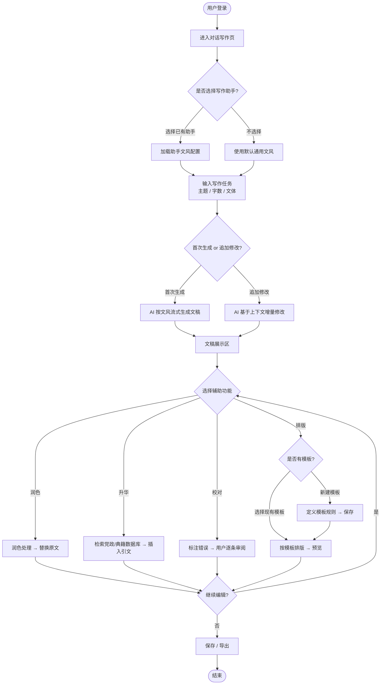
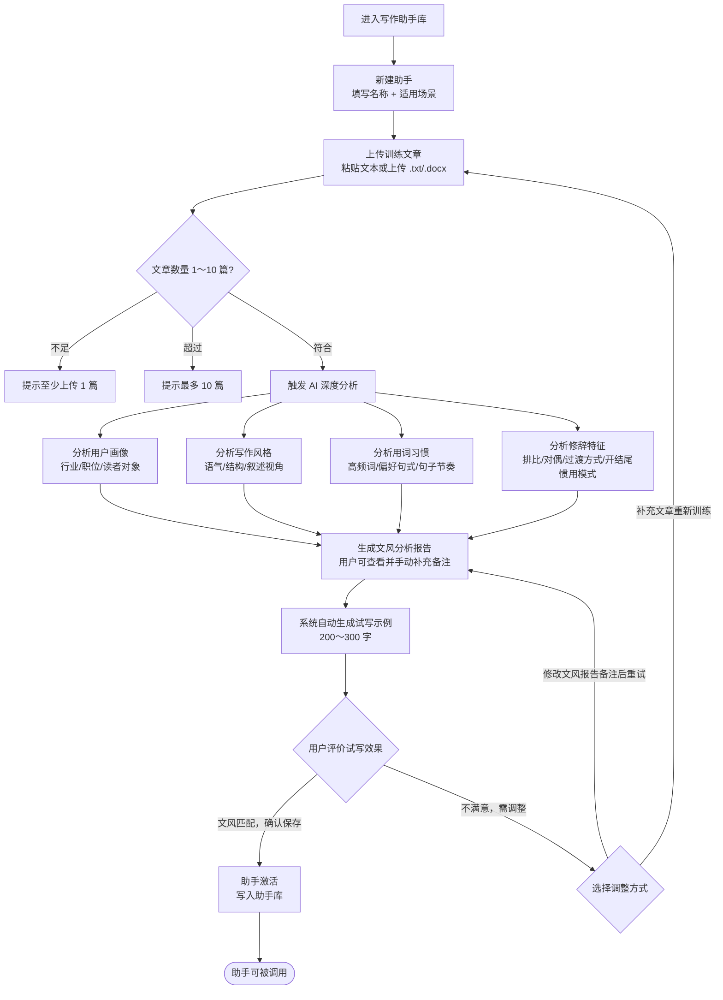
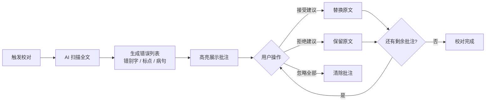
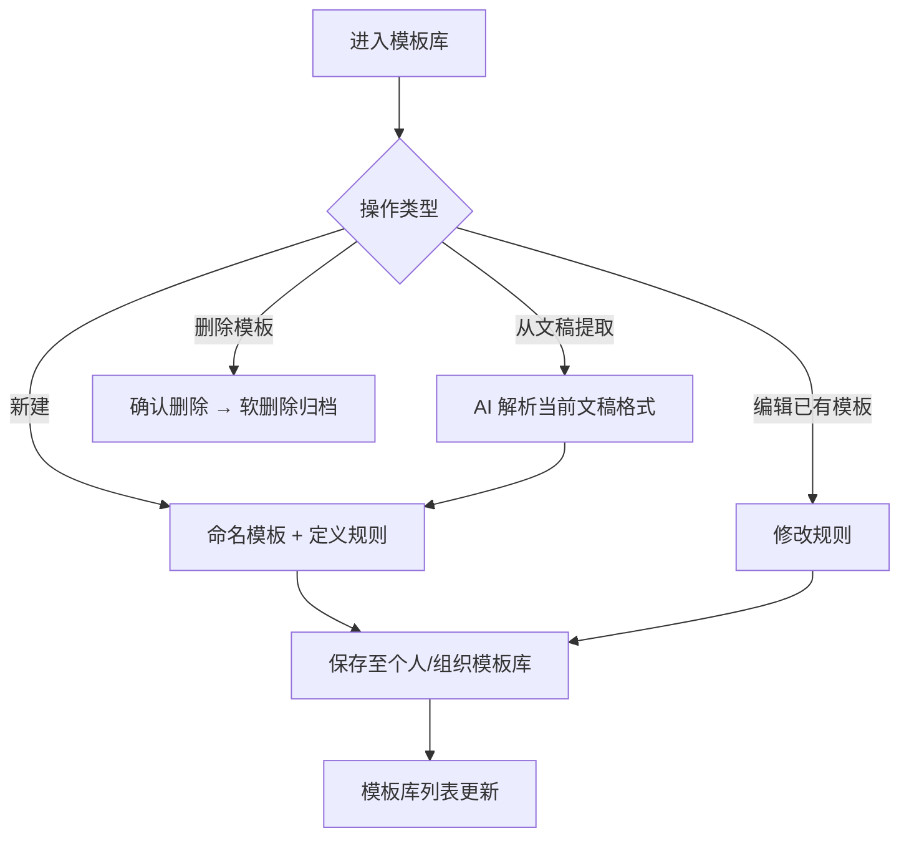

# PRD：AI 职场智能写作平台（政企版）

> 版本：v0.3 | 状态：草稿 | 最后更新：2026-05-29
> 变更说明：明确政府/企业客户定位；升华数据库纳入党政文献与领导人论述；写作助手新增试写验证与多助手支持；新增定价体系（系统费+席位制）与私有化部署选项；MVP 聚焦写作助手文风训练。

---

## 1. 一句话价值主张

专为政府机关与企业职场人打造的 AI 写作平台——训练专属写作分身、引用经典与党政文献，让每一篇公文、汇报、方案都能高效产出，兼具个人风格与思想深度。

---

## 2. 产品定位

| 维度 | 说明 |
|------|------|
| **目标市场** | 政府机关、国有企业、大型民营企业 |
| **种子用户** | 政府机关办公人员（文秘、办公室主任、各级管理干部） |
| **部署方式** | 公有云 SaaS（标准版）+ 私有化部署（政务合规版） |
| **核心差异化** | 可训练的个人文风写作助手 + 经权威授权的经典/党政文献升华数据库 |
| **销售路径** | 政府集采、系统集成商渠道为主 |

---

## 3. 用户故事

### 角色定义

| 角色 | 描述 |
|------|------|
| **机关文秘 / 办公室人员** | 日常负责起草公文、领导讲话稿、工作总结，对文风规范性要求高 |
| **中层管理干部** | 需撰写工作汇报、述职报告、方案材料，有强烈的个人文风偏好 |
| **企业内容运营** | 负责对外公告、品牌文章，需保持组织统一的表达风格 |
| **系统管理员** | 负责单位内部账号管理、席位分配、权限控制及私有化环境维护 |

### 用户故事列表

1. 作为**机关文秘**，我希望上传 5 篇领导过往讲话稿，训练出一个专属写作助手，以便日后起草的讲话稿在表达习惯和用词风格上与领导一贯风格保持一致。

2. 作为**中层管理干部**，我希望训练完写作助手后能立即试写一篇示例，确认"这就是我的风格"，以便在正式使用前对训练质量有直观判断。

3. 作为**机关文秘**，我希望建立多个写作助手分别对应不同场景（如"内部工作汇报风格"和"对外公开文章风格"），以便在不同写作任务中调用最匹配的文风。

4. 作为**中层管理干部**，我希望通过"升华"功能，将汇报材料中的核心观点与《论语》《习近平新时代中国特色社会主义思想》等经典或党政文献中的论述相关联，以便提升文章的思想高度和引用规范性。

5. 作为**企业内容运营**，我希望一键对初稿执行润色功能，将口语化表达替换为正式书面语，以便对外发布内容符合组织形象。

6. 作为**系统管理员**，我希望在后台管理单位内所有账号的席位分配与权限，以便灵活控制不同成员对功能模块的使用范围。

7. 作为**系统管理员（私有化部署场景）**，我希望整套系统运行在本单位服务器上，所有文稿数据不出内网，以便满足政务数据安全合规要求。

---

## 4. 功能清单

### P0 — MVP 核心功能（首期上线，以写作助手文风训练为核心）

| # | 功能模块 | 功能名称 | 简要说明 |
|---|----------|----------|----------|
| 1 | 写作助手库 | 助手创建与管理 | 用户可新建、命名（含场景描述）、删除写作助手；每人最多 20 个助手 |
| 2 | 写作助手库 | 文章上传与训练 | 支持粘贴或上传文章（.txt / .docx），每个助手训练文章数 1～10 篇 |
| 3 | 写作助手库 | 文风深度分析 | AI 对训练文章进行深度分析，输出用户画像、写作风格、用词习惯、修辞特征四大维度的文风报告 |
| 4 | 写作助手库 | 试写验证机制 | 训练完成后，系统用该助手生成一段 200～300 字的示例文稿，用户确认文风匹配后方可保存激活；不满意可补充文章重新训练 |
| 5 | 对话写作 | AI 对话生成（含文风调用） | 用户输入写作任务时可选择写作助手，AI 按助手文风流式生成文稿 |
| 6 | 对话写作 | 多轮修改 | 支持在同一对话内追加指令对生成内容做增量修改 |
| 7 | 辅助功能 | 润色 | 对全文或选中段落进行书面化改写，去除口语词，提升表达规范性 |
| 8 | 辅助功能 | 校对 | 检测错别字、标点错误、病句，以高亮批注呈现，用户可逐条接受/拒绝 |
| 9 | 账号与权限 | 用户账号 | 注册、登录、个人信息管理（支持企业/机关邮箱） |
| 10 | 账号与权限 | 席位管理 | 系统管理员可分配、回收席位，查看席位使用情况 |
| 11 | 基础设施 | 历史记录 | 对话/文稿自动保存，支持列表查看与全文检索 |

### P1 — 重要功能（第二阶段上线）

| # | 功能模块 | 功能名称 | 简要说明 |
|---|----------|----------|----------|
| 12 | 辅助功能 | 升华 | 分析文章核心观点，从经权威授权的经典与党政文献数据库（RAG）中检索匹配语录，嵌入引文与出处注释 |
| 13 | 升华数据库 | 经典典籍库 | 初期覆盖《论语》《孟子》《道德经》《大学》《中庸》等先秦儒道经典（官方授权数据） |
| 14 | 升华数据库 | 党政文献库 | 覆盖党章、历届重要会议文件、习近平新时代中国特色社会主义思想相关论述（官方授权数据） |
| 15 | 辅助功能 | 排版 | 按用户指定模板对文稿进行结构化排版（标题层级、字体样式、段落格式等） |
| 16 | 模板库 | 排版模板管理 | 用户可新建、命名、保存、编辑、删除排版模板；支持从已排版文稿一键提取为模板 |
| 17 | 模板库 | 系统内置模板 | 提供通用公文、工作汇报、会议纪要、项目方案、领导讲话稿等政务场景预置模板 |
| 18 | 辅助功能 | 组合操作 | 支持对同一文稿依次执行多个辅助功能（如先润色再升华） |
| 19 | 写作助手库 | 助手迭代训练 | 支持向已有助手追加训练文章，AI 自动合并更新文风模型，并重新进行试写验证 |

### P2 — 增强功能（后续迭代）

| # | 功能模块 | 功能名称 | 简要说明 |
|---|----------|----------|----------|
| 20 | 协作 | 助手共享 | 管理员可将写作助手共享给组织内成员，统一团队/单位文风 |
| 21 | 导出 | 多格式导出 | 支持将最终文稿导出为 .docx / .pdf / Markdown 格式 |
| 22 | 升华 | 典籍库自定义扩展 | 支持管理员上传本单位私有参考文献，纳入升华匹配范围 |
| 23 | 分析 | 写作质量报告 | 生成可读性评分、词汇多样性、逻辑结构等分析指标 |
| 24 | 个性化 | 文风对比视图 | 展示"通用生成"与"助手文风生成"的差异对比 |
| 25 | 协作 | 文稿审阅流程 | 支持稿件多人评论与审阅状态流转（草稿→审阅中→已通过） |

---

## 5. 核心流程图（Mermaid）

### 5.1 主流程：AI 对话写作（含文风调用）

### 5.2 子流程：写作助手训练与试写验证

### 5.3 子流程：校对功能

### 5.4 子流程：排版模板管理

---

## 6. 定价与账号体系

### 6.1 定价结构

| 费用类型 | 说明 |
|----------|------|
| **系统基础费** | 按年收取，包含平台使用权、功能模块访问权及标准 5 个席位 |
| **席位扩展费** | 超出标准 5 席位后，按额外席位数单独计费（按年/按月均可） |
| **私有化部署费** | 一次性部署实施费 + 年度运维服务费（独立报价） |

### 6.2 账号层级

| 角色 | 权限说明 |
|------|----------|
| **超级管理员** | 管理租户（单位）整体配置、席位总量、计费信息、私有化环境参数 |
| **系统管理员** | 分配/回收席位，管理普通用户账号，查看使用统计报表 |
| **普通用户** | 使用写作、辅助功能及个人写作助手库；不可管理他人账号 |

### 6.3 席位规则

- 标准套餐默认包含 **5 个激活席位**
- 席位可由系统管理员随时分配给指定用户或回收
- 超出席位上限时，新用户无法激活，管理员收到席位不足提醒
- 私有化部署版本席位数由合同约定，系统层面硬性限制

---

## 7. 关键数据字段定义

### 7.1 租户（Tenant）

| 字段名 | 类型 | 说明 | 约束 |
|--------|------|------|------|
| tenant_id | string (UUID) | 租户（单位/企业）唯一标识 | PK, 非空 |
| name | string | 单位/企业名称 | 最长 100 字符, 非空 |
| deploy_type | enum | saas / private | 非空 |
| seat_quota | integer | 已购席位总数（含默认 5 个） | 非空, 最小值 5 |
| seat_used | integer | 已激活席位数 | 非空, 默认 0 |
| contract_start | date | 合同起始日期 | 非空 |
| contract_end | date | 合同到期日期 | 非空 |
| created_at | datetime | 租户创建时间 | 非空 |

### 7.2 用户（User）

| 字段名 | 类型 | 说明 | 约束 |
|--------|------|------|------|
| user_id | string (UUID) | 用户唯一标识 | PK, 非空 |
| tenant_id | string (UUID) | 所属租户 | FK → Tenant, 非空 |
| email | string | 登录邮箱（推荐企业/机关邮箱） | 唯一, 非空 |
| nickname | string | 显示昵称 | 最长 32 字符 |
| role | enum | super_admin / admin / member | 非空, 默认 member |
| is_seat_active | boolean | 是否已分配激活席位 | 默认 false |
| job_title | string | 职位 | 可空 |
| created_at | datetime | 注册时间 | 非空 |

### 7.3 对话会话（Conversation）

| 字段名 | 类型 | 说明 | 约束 |
|--------|------|------|------|
| conversation_id | string (UUID) | 会话唯一标识 | PK, 非空 |
| user_id | string (UUID) | 所属用户 | FK → User |
| assistant_id | string (UUID) | 本次调用的写作助手；未选择则为 null | FK → WritingAssistant, 可空 |
| title | string | 会话标题（自动摘取或手动命名） | 最长 100 字符 |
| created_at | datetime | 创建时间 | 非空 |
| updated_at | datetime | 最后修改时间 | 非空 |

### 7.4 消息（Message）

| 字段名 | 类型 | 说明 | 约束 |
|--------|------|------|------|
| message_id | string (UUID) | 消息唯一标识 | PK, 非空 |
| conversation_id | string (UUID) | 所属会话 | FK → Conversation |
| role | enum | user / assistant | 非空 |
| content | text | 消息正文（含 Markdown） | 非空 |
| operation_type | enum | generate / polish / elevate / proofread / layout / null | 标记触发的辅助操作类型 |
| created_at | datetime | 发送时间 | 非空 |

### 7.5 写作助手（WritingAssistant）

| 字段名 | 类型 | 说明 | 约束 |
|--------|------|------|------|
| assistant_id | string (UUID) | 助手唯一标识 | PK, 非空 |
| user_id | string (UUID) | 创建者 | FK → User, 非空 |
| name | string | 助手名称（如"季度汇报风格"） | 最长 64 字符, 非空 |
| scene_desc | string | 适用场景描述 | 最长 200 字符, 可空 |
| status | enum | training / pending_validation / ready / failed | 非空, 默认 training |
| article_count | integer | 已上传训练文章数 | 范围 1～10 |
| trial_content | text | 试写验证示例文本 | 训练完成后非空 |
| created_at | datetime | 创建时间 | 非空 |
| updated_at | datetime | 最后训练/更新时间 | 非空 |

### 7.6 训练文章（TrainingArticle）

| 字段名 | 类型 | 说明 | 约束 |
|--------|------|------|------|
| article_id | string (UUID) | 文章唯一标识 | PK, 非空 |
| assistant_id | string (UUID) | 所属写作助手 | FK → WritingAssistant |
| title | string | 文章标题 | 最长 100 字符, 可空 |
| content | text | 文章正文 | 非空 |
| word_count | integer | 字数 | 非空 |
| upload_at | datetime | 上传时间 | 非空 |

### 7.7 文风分析报告（StyleProfile）

| 字段名 | 类型 | 说明 | 约束 |
|--------|------|------|------|
| profile_id | string (UUID) | 报告唯一标识 | PK, 非空 |
| assistant_id | string (UUID) | 所属写作助手 | FK → WritingAssistant, 唯一 |
| user_persona | JSON | 用户画像：推断行业、职位层级、目标读者 | 非空 |
| writing_style | JSON | 写作风格：正式度(1-5)、叙述视角、逻辑结构偏好（总分总/递进/并列） | 非空 |
| vocabulary_habit | JSON | 用词习惯：高频专业词表、偏好句式、主被动语态比例、平均句长、文章节奏特征 | 非空 |
| rhetoric_features | JSON | 修辞特征：排比/对偶/引用使用频率、段落过渡方式、开头/结尾惯用模式 | 非空 |
| avoid_words | JSON | 需规避的口语词/低频词列表 | 可空 |
| custom_notes | text | 用户手动补充或修正的备注说明 | 可空 |
| generated_at | datetime | 报告生成时间 | 非空 |

### 7.8 排版模板（LayoutTemplate）

| 字段名 | 类型 | 说明 | 约束 |
|--------|------|------|------|
| template_id | string (UUID) | 模板唯一标识 | PK, 非空 |
| user_id | string (UUID) | 所属用户；系统模板为 null | FK → User, 可空 |
| tenant_id | string (UUID) | 所属租户；系统模板为 null | FK → Tenant, 可空 |
| name | string | 模板名称 | 最长 64 字符, 非空 |
| is_system | boolean | 是否为系统预置模板 | 默认 false |
| definition | JSON | 排版规则（字体、行间距、标题层级、页边距等） | 非空 |
| is_archived | boolean | 是否已软删除归档 | 默认 false |
| created_at | datetime | 创建时间 | 非空 |
| updated_at | datetime | 最后修改时间 | 非空 |

### 7.9 校对批注（ProofreadAnnotation）

| 字段名 | 类型 | 说明 | 约束 |
|--------|------|------|------|
| annotation_id | string (UUID) | 批注唯一标识 | PK, 非空 |
| message_id | string (UUID) | 关联的 AI 生成消息 | FK → Message |
| error_type | enum | typo / punctuation / grammar / logic | 非空 |
| original_text | string | 原始错误文本 | 非空 |
| suggested_text | string | AI 建议替换文本 | 非空 |
| position_start | integer | 错误文本起始字符位置 | 非空 |
| position_end | integer | 错误文本结束字符位置 | 非空 |
| status | enum | pending / accepted / rejected / ignored | 默认 pending |

### 7.10 升华引用（ElevationQuote）

| 字段名 | 类型 | 说明 | 约束 |
|--------|------|------|------|
| quote_id | string (UUID) | 引用唯一标识 | PK, 非空 |
| message_id | string (UUID) | 关联的消息 | FK → Message |
| source_type | enum | classic / party_doc | 引用来源类型：经典典籍 or 党政文献 |
| source_book | string | 文献名称（如《论语》《党章》） | 非空 |
| source_chapter | string | 篇章/条目 | 可空 |
| original_quote | string | 原文引文 | 非空 |
| interpretation | string | AI 生成的释义与连接说明 | 非空 |
| insert_position | integer | 引文插入到文稿的字符位置 | 非空 |
| user_feedback | enum | accepted / rejected / null | 用户对该引文的反馈，用于改善匹配质量 | 默认 null |

---

## 8. 异常场景与边界条件

### 8.1 输入异常

| 场景 | 触发条件 | 系统处理方式 |
|------|----------|--------------|
| 输入为空 | 用户点击发送但输入框为空 | 禁用发送按钮，提示"请输入写作任务" |
| 输入过长 | 单次输入超过 token 上限（建议 4000 字） | 提示字数超限，要求精简或分段输入 |
| 输入含敏感内容 | 触发内容安全过滤 | 拒绝生成，提示违规类型，不记录敏感输入 |

### 8.2 AI 生成异常

| 场景 | 触发条件 | 系统处理方式 |
|------|----------|--------------|
| 生成超时 | AI 响应超过 30 秒无内容返回 | 显示超时提示，提供"重试"按钮，已生成部分可保留 |
| 生成中断 | 网络断开或服务异常导致流式中断 | 保存已生成内容，提示"生成中断，点击继续" |
| 生成内容质量差 | 用户主观认为输出不符合预期 | 提供"重新生成"入口，支持追加指令二次修改 |
| 升华无匹配内容 | 文章主题与数据库关联度过低 | 提示"未找到高度匹配的内容"，建议调整主题或手动选择来源类型 |

### 8.3 写作助手训练异常

| 场景 | 触发条件 | 系统处理方式 |
|------|----------|--------------|
| 文章数量不足 | 上传文章数为 0 | 阻止触发训练，提示"至少上传 1 篇文章" |
| 文章数量超限 | 上传文章数超过 10 篇 | 提示上限，要求删减后再训练 |
| 单篇文章过短 | 单篇文章字数不足 200 字 | 警告"文章过短，分析结果可能不准确"，可继续或放弃 |
| 文章格式错误 | 上传了不支持的文件格式 | 提示支持的格式（.txt / .docx / 粘贴文本），拒绝该文件 |
| 训练分析失败 | AI 服务异常导致分析中断 | 显示"训练失败"状态，保留已上传文章，提供"重新训练"入口 |
| 文章内容高度雷同 | 多篇上传文章文本相似度过高 | 提示"建议上传风格更多样的文章以提升训练质量" |
| 试写效果不满意 | 用户在试写验证环节点击"不满意" | 提供两个路径：①补充文章重新训练；②修改文风报告备注后重新生成试写 |
| 助手数量达上限 | 单用户助手数超过 20 个 | 提示达到上限，需删除旧助手后才能新建 |
| 删除仍被引用的助手 | 删除某助手但历史会话仍引用它 | 软删除，历史会话仍可查看，新会话不可再调用 |

### 8.4 席位与权限异常

| 场景 | 触发条件 | 系统处理方式 |
|------|----------|--------------|
| 席位不足 | 已激活席位数达到 seat_quota 上限 | 新用户无法激活，管理员收到"席位不足"通知，引导购买扩展席位 |
| 合同到期 | 当前日期超过 contract_end | 功能降级为只读（可查看历史，不可新建），提示联系续约 |
| 无席位用户访问 | is_seat_active = false 的用户尝试使用核心功能 | 提示"您尚未分配席位，请联系管理员" |
| 越权操作 | 普通用户尝试访问管理后台 | 返回 403，提示"无操作权限" |

### 8.5 排版模板异常

| 场景 | 触发条件 | 系统处理方式 |
|------|----------|--------------|
| 模板定义冲突 | 模板规则内部存在矛盾 | 保存时校验，高亮冲突项并阻止保存 |
| 模板数量达上限 | 单用户模板数超过 50 个 | 提示达到上限，需删除旧模板后才能新建 |
| 删除被引用模板 | 删除某模板但历史文稿仍引用该模板 | 软删除，历史文稿仍可正常渲染，不可再被新文稿调用 |

### 8.6 私有化部署异常

| 场景 | 触发条件 | 系统处理方式 |
|------|----------|--------------|
| 内网 AI 服务不可用 | 私有化部署的大模型服务宕机 | 显示服务异常提示，建议联系本单位系统管理员；不回退到公有云 |
| 离线环境数据同步 | 私有化环境与典籍/党政数据库版本不一致 | 提示"数据库版本需更新"，管理员可手动触发离线包更新 |

---

## 9. 待澄清问题

### ✅ 已解答

| 问题 | 答案 |
|------|------|
| 目标用户是 C 端还是 B 端？ | 明确为 B 端，种子用户为政府机关办公人员 |
| 是否支持私有化部署？ | 是，SaaS 与私有化部署并行 |
| 文风训练需要还原结构还是风格？ | 还原表达习惯、用词习惯、文章节奏，不强制复制结构 |
| 是否需要多个写作助手？ | 是，每人可建多个助手对应不同场景 |
| 升华是核心卖点还是附加功能？ | 核心差异化卖点，特别面向政府用户 |
| 数据来源是否权威？ | 已获得官方数据授权，数据质量有保障 |
| 国产大模型选型？ | 已有备选方案，不是问题 |
| 商业化模式？ | 系统基础费（含 5 席位）+ 扩展席位按需计费 |
| 销售路径？ | 政府集采和系统集成商渠道为主 |
| MVP 核心功能是什么？ | 写作助手文风训练是让用户第一次付费的核心理由 |

### ⚠️ 仍需澄清

### 问题 1：升华功能中党政文献的引文呈现方式
- **模糊之处**：党政文献引文是嵌入正文段落（行内注释），还是作为独立模块附在文末？引用格式是否需要符合特定规范（如党内文件引用格式）？用户能否在引用前预览并选择是否采用某条引文？
- **建议澄清**：明确引文插入位置、引用格式规范，以及用户对引文的控制粒度。

### 问题 2：文风分析报告的可编辑边界
- **模糊之处**：AI 生成的文风报告（用词习惯、写作风格等），用户可以手动修改哪些字段？修改后如何与原始分析合并？是否允许用户不上传文章、纯手工填写文风参数创建助手？
- **建议澄清**：明确报告的可编辑字段范围和手动覆盖逻辑。

### 问题 3：排版模板规则的具体维度
- **模糊之处**：排版模板仅控制视觉样式（字体、行距、标题层级），还是也包含内容结构骨架（如"正文 = 引言 + 3 个论点 + 结论"）？用户创建模板的操作方式是表单填写、上传示例文档，还是规则编辑器？
- **建议澄清**：确定模板的最小可行定义集合及创建操作路径。

### 问题 4：多次辅助操作的版本管理
- **模糊之处**：对同一篇文章依次执行润色→升华→校对后，是否需要保留每步操作前的版本快照？用户是否可以回退到某个历史版本？
- **建议澄清**：确定是否需要版本快照机制及版本保留上限。

### 问题 5：私有化部署的典籍/党政数据库更新机制
- **模糊之处**：私有化部署环境与外网隔离，当典籍数据库或党政文献库有新内容更新时，客户如何获得更新（离线安装包、U 盘导入、专线同步）？更新频率预期是多少？
- **建议澄清**：明确私有化版本数据库的更新交付方式和 SLA。

---

*文档由 AI 助手根据多轮产品访谈整理（v0.3），待产品负责人审阅后进入正式评审流程。*
