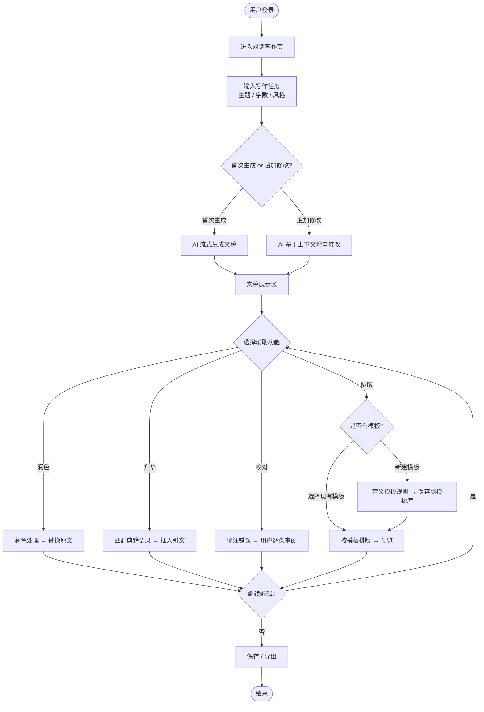
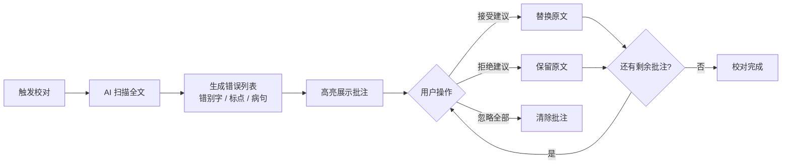
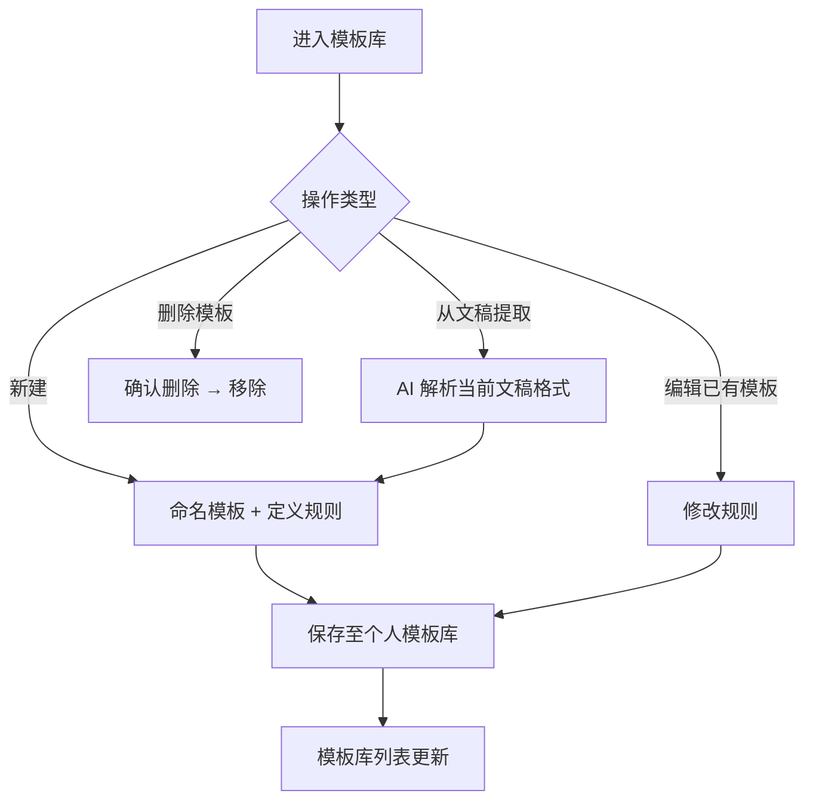

# PRD：AI 智能写作平台

> 版本：v0.1 | 状态：草稿 | 最后更新：2026-05-29

---

## 1. 一句话价值主张

借助 AI 对话式交互，帮助用户快速完成写作、一键润色、融合经典哲学思想、智能校对与自动排版，让每一篇文章兼具效率与深度。

---

## 2. 用户故事

### 角色定义

| 角色 | 描述 |
|------|------|
| **内容创作者** | 需要高频产出文章、报告、推文的个人用户（自媒体、博主、学生） |
| **职场写作者** | 需要撰写工作汇报、方案、邮件的职场人士 |
| **研究/教育工作者** | 需要在文章中引用经典理论与哲学典籍的学者、教师 |
| **编辑/审校人员** | 需要对他人稿件进行润色、校对、统一格式的专业编辑 |

### 用户故事列表

1. 作为**内容创作者**，我希望在对话框中描述写作主题后，AI 能自动生成完整文章草稿，以便大幅缩短从构思到成文的时间。

2. 作为**职场写作者**，我希望一键对已有文稿执行润色功能，将口语化表达自动替换为正式书面语，以便提升汇报材料的专业形象。

3. 作为**研究/教育工作者**，我希望通过"升华"功能将我的文章观点与《论语》《孟子》等经典典籍关联，以便使文章更有思想深度和引用价值。

4. 作为**内容创作者**，我希望使用"校对"功能自动检测文稿中的错别字、语法错误和逻辑表达问题，以便减少人工审读的时间成本。

5. 作为**编辑/审校人员**，我希望保存自定义排版模板并在每次输出时一键调用，以便保证所有稿件风格统一、格式规范。

6. 作为**职场写作者**，我希望历史对话与生成记录都能被保存和检索，以便随时回溯之前的写作内容或继续未完成的任务。

---

## 3. 功能清单

### P0 — 核心功能（MVP 必须上线）

| # | 功能模块 | 功能名称 | 简要说明 |
|---|----------|----------|----------|
| 1 | 对话写作 | AI 对话生成 | 用户在聊天框输入写作任务（主题、字数、风格等），AI 实时流式返回完整文稿 |
| 2 | 对话写作 | 多轮修改 | 用户可在同一对话内对生成内容发出追加指令（如"缩短开头"、"换个更正式的结尾"） |
| 3 | 辅助功能 | 润色 | 对选中文本或全文进行书面化改写，去除口语词、提升表达准确性 |
| 4 | 辅助功能 | 校对 | 检测错别字、标点错误、病句，以批注或高亮形式呈现，用户可逐条接受/拒绝 |
| 5 | 基础设施 | 用户账号 | 注册、登录、基本个人信息管理 |
| 6 | 基础设施 | 历史记录 | 对话/文稿自动保存，支持列表查看与全文检索 |

### P1 — 重要功能（第二阶段上线）

| # | 功能模块 | 功能名称 | 简要说明 |
|---|----------|----------|----------|
| 7 | 辅助功能 | 升华 | 分析文章核心观点，关联匹配《论语》《孟子》《道德经》等经典语录，嵌入引文与出处注释 |
| 8 | 辅助功能 | 排版 | 按用户指定或选取的模板对文稿进行结构化排版（标题层级、字体样式、段落格式等） |
| 9 | 模板库 | 排版模板管理 | 用户可新建、命名、保存、编辑、删除排版模板；支持从已排版文稿一键提取为模板 |
| 10 | 模板库 | 系统内置模板 | 提供通用公文、学术论文、公众号文章等官方预置模板供快速调用 |
| 11 | 辅助功能 | 组合操作 | 支持用户对同一文稿依次或同时执行多个辅助功能（如先润色再升华） |

### P2 — 增强功能（后续迭代）

| # | 功能模块 | 功能名称 | 简要说明 |
|---|----------|----------|----------|
| 12 | 导出 | 多格式导出 | 支持将最终文稿导出为 .docx / .pdf / Markdown 格式 |
| 13 | 升华 | 典籍知识库扩展 | 支持接入更多经典（二十四史、唐诗宋词等），并允许用户上传私有参考文献 |
| 14 | 协作 | 团队共享 | 多人共享文稿与模板库，支持评论与版本对比 |
| 15 | 分析 | 写作报告 | 生成可读性评分、词汇多样性、逻辑结构等写作质量分析报告 |
| 16 | 个性化 | 写作风格偏好 | 用户可设定惯用文风（学术/商务/文学），AI 生成时自动匹配 |

---

## 4. 核心流程图（Mermaid）

### 4.1 主流程：AI 对话写作

### 4.2 子流程：校对功能

### 4.3 子流程：排版模板管理

---

## 5. 关键数据字段定义

### 5.1 用户（User）

| 字段名 | 类型 | 说明 | 约束 |
|--------|------|------|------|
| user_id | string (UUID) | 用户唯一标识 | PK, 非空 |
| email | string | 登录邮箱 | 唯一, 非空 |
| nickname | string | 显示昵称 | 最长 32 字符 |
| writing_style | enum | 偏好文风：academic / business / literary / auto | 默认 auto |
| created_at | datetime | 注册时间 | 非空 |

### 5.2 对话会话（Conversation）

| 字段名 | 类型 | 说明 | 约束 |
|--------|------|------|------|
| conversation_id | string (UUID) | 会话唯一标识 | PK, 非空 |
| user_id | string (UUID) | 所属用户 | FK → User |
| title | string | 会话标题（自动摘取或手动命名） | 最长 100 字符 |
| created_at | datetime | 创建时间 | 非空 |
| updated_at | datetime | 最后修改时间 | 非空 |

### 5.3 消息（Message）

| 字段名 | 类型 | 说明 | 约束 |
|--------|------|------|------|
| message_id | string (UUID) | 消息唯一标识 | PK, 非空 |
| conversation_id | string (UUID) | 所属会话 | FK → Conversation |
| role | enum | user / assistant | 非空 |
| content | text | 消息正文（含 Markdown） | 非空 |
| operation_type | enum | generate / polish / elevate / proofread / layout / null | 标记触发的辅助操作 |
| created_at | datetime | 发送时间 | 非空 |

### 5.4 排版模板（LayoutTemplate）

| 字段名 | 类型 | 说明 | 约束 |
|--------|------|------|------|
| template_id | string (UUID) | 模板唯一标识 | PK, 非空 |
| user_id | string (UUID) | 所属用户；系统模板为 null | FK → User, 可空 |
| name | string | 模板名称 | 最长 64 字符, 非空 |
| is_system | boolean | 是否为系统预置模板 | 默认 false |
| definition | JSON | 排版规则（字体、行间距、标题层级、页边距等） | 非空 |
| created_at | datetime | 创建时间 | 非空 |
| updated_at | datetime | 最后修改时间 | 非空 |

### 5.5 校对批注（ProofreadAnnotation）

| 字段名 | 类型 | 说明 | 约束 |
|--------|------|------|------|
| annotation_id | string (UUID) | 批注唯一标识 | PK, 非空 |
| message_id | string (UUID) | 关联的 AI 生成消息 | FK → Message |
| error_type | enum | typo / punctuation / grammar / logic | 非空 |
| original_text | string | 原始错误文本 | 非空 |
| suggested_text | string | AI 建议替换文本 | 非空 |
| position_start | integer | 错误文本起始字符位置 | 非空 |
| position_end | integer | 错误文本结束字符位置 | 非空 |
| status | enum | pending / accepted / rejected / ignored | 默认 pending |

### 5.6 升华引用（ElevationQuote）

| 字段名 | 类型 | 说明 | 约束 |
|--------|------|------|------|
| quote_id | string (UUID) | 引用唯一标识 | PK, 非空 |
| message_id | string (UUID) | 关联的消息 | FK → Message |
| source_book | string | 典籍名称（如《论语》） | 非空 |
| source_chapter | string | 篇章（如"学而第一"） | 可空 |
| original_quote | string | 原文引文 | 非空 |
| interpretation | string | AI 生成的释义与连接说明 | 非空 |
| insert_position | integer | 引文插入到文稿的字符位置 | 非空 |

---

## 6. 异常场景与边界条件

### 6.1 输入异常

| 场景 | 触发条件 | 系统处理方式 |
|------|----------|--------------|
| 输入为空 | 用户点击发送但输入框为空 | 禁用发送按钮，提示"请输入写作任务" |
| 输入过长 | 单次输入超过 token 上限（建议 4000 字） | 提示字数超限，要求精简或分段输入 |
| 输入含敏感内容 | 触发内容安全过滤 | 拒绝生成，提示违规类型，不记录敏感输入 |
| 语言非中文 | 用户输入英文或其他语言 | 明确是否支持多语言；MVP 阶段可提示"当前仅支持中文" |

### 6.2 AI 生成异常

| 场景 | 触发条件 | 系统处理方式 |
|------|----------|--------------|
| 生成超时 | AI 响应超过 30 秒无内容返回 | 显示超时提示，提供"重试"按钮，已生成部分可保留 |
| 生成中断 | 网络断开或服务异常导致流式中断 | 保存已生成内容，提示"生成中断，点击继续" |
| 生成内容质量差 | 用户主观认为输出不符合预期 | 提供"重新生成"入口，支持追加指令二次修改 |
| 升华无匹配典籍 | 文章主题与典籍关联度过低 | 提示"未找到高度匹配的经典语录"，建议调整主题或手动选择典籍范围 |

### 6.3 排版模板异常

| 场景 | 触发条件 | 系统处理方式 |
|------|----------|--------------|
| 模板定义冲突 | 模板规则内部存在矛盾（如字号超出范围） | 保存时校验，高亮冲突项并阻止保存 |
| 模板数量上限 | 单用户模板数超过上限（建议 50 个） | 提示达到上限，需删除旧模板后才能新建 |
| 删除被引用模板 | 删除某模板但历史文稿仍引用该模板 | 软删除（标记为已归档），历史文稿仍可正常渲染，不可再被新文稿调用 |

### 6.4 校对异常

| 场景 | 触发条件 | 系统处理方式 |
|------|----------|--------------|
| 文稿过短 | 文稿不足 10 字 | 提示"文稿太短，暂不支持校对" |
| 批注数量极多 | 单次校对产生超过 200 条批注 | 分页展示批注，提示"发现大量问题，建议先进行润色再校对" |
| 用户修改后重复校对 | 接受部分建议后再次触发校对 | 对修改后全文重新扫描，清除旧批注，生成新批注列表 |

### 6.5 账号与权限

| 场景 | 触发条件 | 系统处理方式 |
|------|----------|--------------|
| 未登录访问 | 未登录用户尝试生成内容 | 弹出登录/注册引导弹窗 |
| 免费额度耗尽 | 用户当日/当月 token 用量达到上限 | 提示额度信息，引导升级付费计划 |
| 会话数据丢失 | 异常退出导致未保存内容 | 本地草稿缓存（localStorage），下次进入时提示恢复 |

---

## 7. 待澄清问题

以下问题在原始需求中尚未明确，建议在下一次评审前与需求方确认：

### 问题 1：升华功能的触发逻辑与呈现方式
- **模糊之处**：升华是对全文整体匹配，还是对每个段落分别匹配？引文是插入到文章内部（行内注释）、还是以"参考延伸"模块附在文末？用户是否可以选择想关联的典籍范围（如"只匹配《论语》"或"匹配所有儒家经典"）？
- **建议澄清**：明确插入位置规则、引文呈现样式，以及典籍知识库的初始覆盖范围。

### 问题 2：排版模板的"规则"具体包含哪些维度
- **模糊之处**：排版模板仅控制视觉样式（字体、行距、标题层级），还是也包含结构模板（如"正文 = 引言 + 3 个论点 + 结论"这类内容骨架）？模板的定义方式是表单填写、上传示例文档，还是类 CSS 的规则编辑器？
- **建议澄清**：确定模板的最小可行定义集合，以及用户创建模板的操作路径。

### 问题 3：润色、升华、校对、排版的操作对象
- **模糊之处**：这四个功能是作用于"当前 AI 生成的最新文稿"，还是允许用户粘贴自己写的外部文章进行处理？如果支持外部粘贴，这类内容是否也纳入历史记录？
- **建议澄清**：明确输入源（AI 生成 vs. 用户自带），决定是否需要独立的"文稿上传/粘贴"入口。

### 问题 4：多次辅助操作的叠加与版本管理
- **模糊之处**：对同一篇文章先润色、再升华、再校对后，是否保留每一步操作前的版本？用户能否回退到某个历史版本？如果不保留版本，误操作如何恢复？
- **建议澄清**：确定是否需要操作历史/版本快照机制，以及版本保留的数量上限。

### 问题 5：目标用户与商业化模式
- **模糊之处**：产品面向个人用户（C 端）还是企业客户（B 端）？是否有付费计划，免费用户与付费用户在功能/额度上有何区别？这将直接影响账号体系、模板共享、使用量计量等多个模块的设计。
- **建议澄清**：确认产品定位与初期变现路径，以便合理划分免费/付费功能边界。

### 问题 6：AI 模型选型与数据隐私
- **模糊之处**：后端调用哪个 AI 模型（自研 or 第三方 API）？用户输入的文稿内容是否会用于模型训练？数据存储在境内还是境外？这些问题涉及合规与用户隐私承诺。
- **建议澄清**：明确 AI 供应商选择及数据处理协议，确保符合《个人信息保护法》要求。

---

*文档由 AI 助手根据市场部需求描述整理，待产品负责人审阅后进入正式评审流程。*
